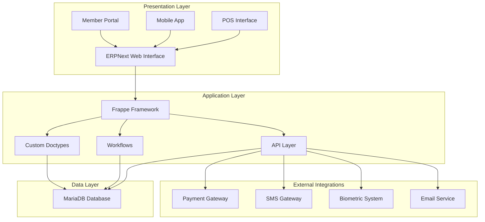
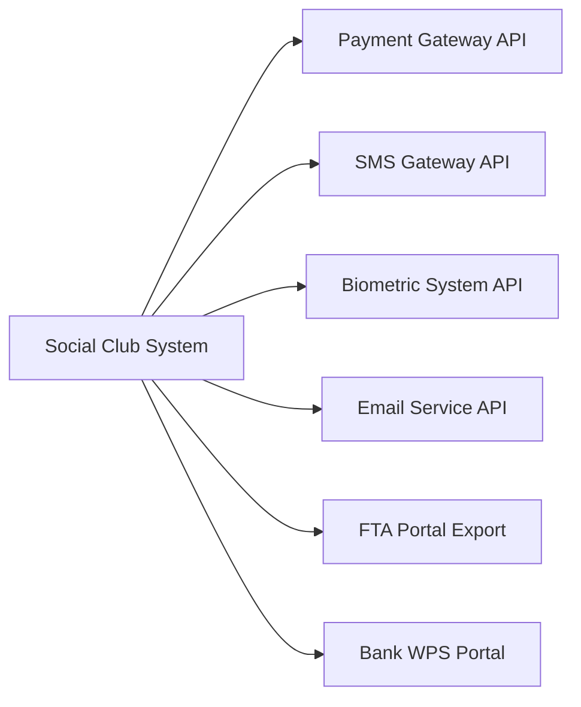
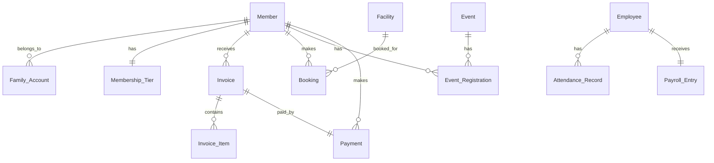

# Design Document: Social Club Management System

## Overview

The Social Club Management System is a comprehensive solution built on ERPNext  with Frappe Framework, designed specifically for UAE social clubs. The system manages the complete lifecycle of club operations including membership management, billing with UAE VAT compliance, facility bookings, event management, F&B operations, financial management with IFRS compliance, HR & payroll with UAE Labour Law compliance, and a member self-service portal.

### Key Design Principles

1. **UAE Compliance First**: All financial, tax, and HR modules are designed to meet UAE regulatory requirements including VAT, FTA, and Labour Law compliance
2. **ERPNext Native**: Leverages ERPNext's built-in capabilities while extending with custom doctypes and workflows
3. **Real-time Operations**: Facility bookings, inventory, and financial data are updated in real-time
4. **Member-Centric**: Provides comprehensive self-service capabilities through the member portal
5. **Audit Trail**: Maintains immutable records for all financial transactions and critical operations
6. **Scalable Architecture**: Designed to handle multiple clubs and thousands of members

### System Boundaries

**In Scope:**
- Complete membership lifecycle management
- UAE VAT compliant billing and invoicing
- Real-time facility booking system
- Event management with capacity controls
- F&B POS and inventory management
- IFRS compliant financial reporting
- UAE Labour Law compliant HR & payroll
- Member self-service portal
- Management dashboards and reporting

**Out of Scope:**
- Physical access control systems (integrates via API)
- Payment gateway implementation (integrates with existing gateways)
- SMS gateway implementation (integrates with existing providers)
- Biometric hardware (integrates via API)

## Architecture

### High-Level Architecture

The system follows ERPNext's three-tier architecture with custom extensions:



### Technology Stack

- **Backend Framework**: Frappe Framework (Python)
- **Frontend**: ERPNext Web Interface + Custom Portal (HTML/CSS/JavaScript)
- **Database**: MariaDB 10.6+
- **Web Server**: Nginx
- **Application Server**: Gunicorn
- **Task Queue**: Redis + RQ
- **File Storage**: Local filesystem with backup to cloud
- **Caching**: Redis

### Integration Architecture



## Components and Interfaces

### Core Modules

#### 1. Membership Management Module

**Components:**
- Member Registration Service
- Membership Tier Management
- Renewal Processing Engine
- Status Tracking Service

**Key Interfaces:**
- `MemberService.register(member_data)` - Creates new member with validation
- `MembershipTierService.assign_tier(member_id, tier)` - Assigns membership tier
- `RenewalService.process_renewal(member_id)` - Handles membership renewal
- `StatusService.update_status(member_id, status)` - Updates membership status

#### 2. Billing & Payments Module

**Components:**
- Invoice Generation Engine
- UAE VAT Calculator
- Payment Gateway Integration
- Recurring Billing Service

**Key Interfaces:**
- `InvoiceService.generate(member_id, items)` - Creates VAT-compliant invoices
- `VATService.calculate(amount, vat_rate)` - Calculates UAE VAT
- `PaymentService.process(invoice_id, gateway_data)` - Processes payments
- `RecurringService.generate_recurring()` - Creates recurring invoices

#### 3. Facility Booking Module

**Components:**
- Real-time Calendar Service
- Booking Validation Engine
- Pricing Calculator
- Cancellation Handler

**Key Interfaces:**
- `CalendarService.get_availability(facility_id, date_range)` - Returns available slots
- `BookingService.create(member_id, facility_id, datetime)` - Creates booking
- `PricingService.calculate(member_tier, facility, duration)` - Calculates pricing
- `CancellationService.cancel(booking_id, reason)` - Handles cancellations

#### 4. Event Management Module

**Components:**
- Event Registration Service
- Capacity Management Engine
- Ticketing System
- Waitlist Manager

**Key Interfaces:**
- `EventService.register(member_id, event_id)` - Registers member for event
- `CapacityService.check_availability(event_id)` - Checks event capacity
- `TicketService.generate(registration_id)` - Generates QR code tickets
- `WaitlistService.add_to_waitlist(member_id, event_id)` - Manages waitlists

#### 5. F&B Operations Module

**Components:**
- POS Transaction Engine
- Inventory Management System
- Member Account Charging
- Menu Management

**Key Interfaces:**
- `POSService.process_transaction(items, member_id)` - Processes F&B sales
- `InventoryService.update_stock(item_id, quantity)` - Updates inventory
- `AccountService.charge_member(member_id, amount)` - Charges member account
- `MenuService.get_menu(category)` - Retrieves menu items

#### 6. Financial Management Module

**Components:**
- IFRS Reporting Engine
- UAE VAT 201 Generator
- Audit Trail Service
- Chart of Accounts Manager

**Key Interfaces:**
- `ReportingService.generate_ifrs_report(report_type, period)` - IFRS reports
- `VATReturnService.generate_vat201(period)` - VAT 201 returns
- `AuditService.log_transaction(transaction_data)` - Audit logging
- `AccountService.get_chart_of_accounts()` - Account structure

#### 7. HR & Payroll Module

**Components:**
- Attendance Tracking Service
- EOS Calculator
- WPS File Generator
- Payroll Processing Engine

**Key Interfaces:**
- `AttendanceService.record(employee_id, clock_in, clock_out)` - Records attendance
- `EOSService.calculate(employee_id, termination_date)` - Calculates EOS
- `WPSService.generate_file(payroll_period)` - Generates WPS files
- `PayrollService.process(period)` - Processes payroll

#### 8. Member Portal Module

**Components:**
- Authentication Service
- Self-Service Booking Interface
- Payment History Viewer
- Profile Management

**Key Interfaces:**
- `AuthService.authenticate(username, password)` - Member authentication
- `PortalBookingService.book_facility(member_id, booking_data)` - Portal bookings
- `PaymentHistoryService.get_history(member_id, filters)` - Payment history
- `ProfileService.update(member_id, profile_data)` - Profile updates

### External Integration Interfaces

#### Payment Gateway Integration
```python
class PaymentGatewayInterface:
    def initiate_payment(self, amount, currency, member_id) -> str
    def verify_payment(self, transaction_id) -> PaymentStatus
    def process_refund(self, transaction_id, amount) -> RefundStatus
```

#### SMS Gateway Integration
```python
class SMSGatewayInterface:
    def send_sms(self, mobile_number, message) -> SMSStatus
    def get_delivery_status(self, message_id) -> DeliveryStatus
```

#### Biometric System Integration
```python
class BiometricSystemInterface:
    def get_attendance_records(self, date_range) -> List[AttendanceRecord]
    def sync_employee_data(self, employees) -> SyncStatus
```

## Data Models

### Core Entity Relationships



### Key Doctypes (ERPNext Custom Doctypes)

#### Member
```json
{
  "doctype": "Member",
  "fields": {
    "member_id": "Data (Unique)",
    "first_name": "Data (Required)",
    "last_name": "Data (Required)",
    "email": "Data (Unique, Required)",
    "mobile": "Data (Required)",
    "nationality": "Link (Country)",
    "membership_tier": "Link (Membership Tier)",
    "membership_status": "Select (Active/Expired/Suspended/Pending)",
    "membership_start_date": "Date",
    "membership_expiry_date": "Date",
    "family_account": "Link (Family Account)",
    "emergency_contact_name": "Data",
    "emergency_contact_mobile": "Data",
    "credit_limit": "Currency",
    "current_balance": "Currency"
  }
}
```

#### Membership Tier
```json
{
  "doctype": "Membership Tier",
  "fields": {
    "tier_name": "Data (Individual/Family/Corporate/VIP)",
    "annual_fee": "Currency",
    "credit_limit": "Currency",
    "facility_discount_percentage": "Percent",
    "event_discount_percentage": "Percent",
    "privileges": "Text Editor"
  }
}
```

#### Facility Booking
```json
{
  "doctype": "Facility Booking",
  "fields": {
    "booking_id": "Data (Auto-generated)",
    "member": "Link (Member)",
    "facility": "Link (Facility)",
    "booking_date": "Date",
    "start_time": "Time",
    "end_time": "Time",
    "duration_hours": "Float",
    "base_amount": "Currency",
    "discount_amount": "Currency",
    "vat_amount": "Currency",
    "total_amount": "Currency",
    "status": "Select (Confirmed/Cancelled/Completed)",
    "cancellation_reason": "Text",
    "invoice": "Link (Sales Invoice)"
  }
}
```

#### Club Event
```json
{
  "doctype": "Club Event",
  "fields": {
    "event_name": "Data (Required)",
    "event_date": "Date",
    "start_time": "Time",
    "end_time": "Time",
    "venue": "Data",
    "description": "Text Editor",
    "maximum_capacity": "Int",
    "current_registrations": "Int",
    "registration_fee": "Currency",
    "registration_deadline": "Date",
    "status": "Select (Open/Full/Closed/Cancelled)"
  }
}
```

#### Event Registration
```json
{
  "doctype": "Event Registration",
  "fields": {
    "member": "Link (Member)",
    "event": "Link (Club Event)",
    "registration_date": "Date",
    "number_of_attendees": "Int",
    "total_amount": "Currency",
    "ticket_qr_code": "Data",
    "status": "Select (Registered/Paid/Attended/Cancelled)",
    "invoice": "Link (Sales Invoice)"
  }
}
```

#### F&B Transaction
```json
{
  "doctype": "F&B Transaction",
  "fields": {
    "transaction_id": "Data (Auto-generated)",
    "member": "Link (Member)",
    "transaction_date": "Datetime",
    "items": "Table (F&B Transaction Item)",
    "subtotal": "Currency",
    "vat_amount": "Currency",
    "total_amount": "Currency",
    "payment_method": "Select (Cash/Card/Member Account)",
    "invoice": "Link (Sales Invoice)"
  }
}
```

#### UAE VAT Settings
```json
{
  "doctype": "UAE VAT Settings",
  "fields": {
    "company_trn": "Data (Tax Registration Number)",
    "vat_rate": "Percent (Default: 5%)",
    "vat_collected_account": "Link (Account)",
    "vat_paid_account": "Link (Account)",
    "fta_portal_username": "Data",
    "auto_generate_vat_return": "Check"
  }
}
```

#### Employee Attendance
```json
{
  "doctype": "Employee Attendance",
  "fields": {
    "employee": "Link (Employee)",
    "attendance_date": "Date",
    "clock_in_time": "Datetime",
    "clock_out_time": "Datetime",
    "total_hours": "Float",
    "overtime_hours": "Float",
    "status": "Select (Present/Absent/Half Day)",
    "biometric_device_id": "Data",
    "remarks": "Text"
  }
}
```

### Database Schema Considerations

#### Indexing Strategy
- Primary keys on all ID fields
- Composite indexes on (member_id, date) for time-series data
- Indexes on frequently queried fields (email, mobile, membership_status)
- Full-text indexes on search fields (member names, event descriptions)

#### Data Partitioning
- Partition large tables (invoices, transactions) by year
- Archive old data beyond retention period
- Separate read replicas for reporting queries

#### Audit Trail Schema
```json
{
  "doctype": "Audit Trail",
  "fields": {
    "transaction_id": "Data (Required)",
    "doctype": "Data (Required)",
    "document_name": "Data (Required)",
    "action": "Select (Create/Update/Delete/Submit/Cancel)",
    "user": "Link (User)",
    "timestamp": "Datetime",
    "old_values": "JSON",
    "new_values": "JSON",
    "ip_address": "Data",
    "user_agent": "Text"
  }
}
```
## Correctness Properties

*A property is a characteristic or behavior that should hold true across all valid executions of a system-essentially, a formal statement about what the system should do. Properties serve as the bridge between human-readable specifications and machine-verifiable correctness guarantees.*

### Property 1: Member Registration Completeness

*For any* member registration submission with valid data, the system should create a Member record containing all required fields (name, contact details, nationality, emergency contact) and assign a unique member ID.

**Validates: Requirements 1.1, 1.2**

### Property 2: Family Account Linking

*For any* member registration with Family membership type, the system should create a Family_Account that properly links all family members.

**Validates: Requirements 1.3**

### Property 3: Email Uniqueness Validation

*For any* member registration attempt, the system should reject registrations with email addresses that already exist in the system.

**Validates: Requirements 1.4**

### Property 4: UAE Mobile Format Validation

*For any* mobile number input, the system should only accept numbers that follow UAE format (+971-XX-XXX-XXXX) and reject all other formats.

**Validates: Requirements 1.5**

### Property 5: Membership Tier Assignment

*For any* member creation, the system should assign a valid Membership_Tier from available options and apply the corresponding annual fee and privileges.

**Validates: Requirements 2.1, 2.2, 2.3**

### Property 6: Membership Renewal Processing

*For any* membership with expiry date 30 days away, the system should generate a renewal invoice, and when paid, extend the expiry date by one year.

**Validates: Requirements 3.1, 3.2**

### Property 7: Membership Status Transitions

*For any* membership, the system should automatically update status to Expired when expiry date passes, and to Active when payment is received.

**Validates: Requirements 3.3, 4.2, 4.3**

### Property 8: Status-Based Access Control

*For any* member with Expired or Suspended status, the system should prevent facility bookings, event registrations, account charging, and portal login.

**Validates: Requirements 4.4, 9.1, 16.1, 38.2, 38.3**

### Property 9: VAT Calculation Consistency

*For any* taxable transaction (membership fees, bookings, events, F&B), the system should calculate VAT at exactly 5% and store VAT amount separately from base amount.

**Validates: Requirements 5.3, 6.1, 6.2, 14.2**

### Property 10: Email Notification Timing

*For any* system event requiring email notification (renewal reminders, booking confirmations, invoice generation), the system should send emails within the specified time limits (5 minutes for bookings, 24 hours for invoices).

**Validates: Requirements 3.4, 5.4, 9.5, 10.4**

### Property 11: Invoice Generation Consistency

*For any* billable event (membership renewal, facility booking, event registration, F&B transaction, member account charge), the system should generate a properly formatted invoice with VAT compliance and member linkage.

**Validates: Requirements 3.1, 5.1, 9.3, 11.3, 14.4, 16.2**

### Property 12: VAT Compliance Structure

*For any* invoice generated, the system should include TRN (Tax Registration Number), maintain separate VAT accounts, and follow UAE VAT compliance requirements.

**Validates: Requirements 6.3, 6.4**

### Property 13: Payment Gateway Integration

*For any* online payment attempt, the system should properly redirect to payment gateway, process confirmations/failures, and store transaction IDs with payment records.

**Validates: Requirements 7.1, 7.2, 7.3, 7.4**

### Property 14: Real-time Facility Availability

*For any* facility booking creation or cancellation, the system should immediately update availability status and prevent double-booking of overlapping time periods.

**Validates: Requirements 8.2, 8.3, 10.3**

### Property 15: Booking Validation and Pricing

*For any* booking attempt, the system should validate time slot availability and apply tier-specific pricing based on member's membership tier.

**Validates: Requirements 9.2, 9.4**

### Property 16: Cancellation Fee Calculation

*For any* booking cancellation, the system should calculate refunds based on timing: full refund if >24 hours before, 50% cancellation fee if <24 hours before.

**Validates: Requirements 10.1, 10.2**

### Property 17: Event Capacity Management

*For any* event, the system should track current registrations against maximum capacity, prevent registrations when full, and automatically mark events as full when capacity is reached.

**Validates: Requirements 11.2, 12.2, 12.3, 12.4**

### Property 18: Unique Identifier Generation

*For any* system entity requiring unique identification (member IDs, QR codes), the system should generate unique identifiers that are never duplicated.

**Validates: Requirements 1.2, 13.1**

### Property 19: Event Ticketing Round Trip

*For any* paid event registration, the system should generate a ticket with unique QR code, store the code for validation, and properly validate and mark tickets as used when scanned.

**Validates: Requirements 13.1, 13.3, 13.4**

### Property 20: F&B Inventory Updates

*For any* F&B item sale, the system should decrement inventory quantity and generate purchase requisitions when quantity falls below reorder level.

**Validates: Requirements 15.1, 15.2**

### Property 21: Inventory Audit Trail

*For any* inventory movement, the system should track date, quantity, user information, and calculate valuation using weighted average cost method.

**Validates: Requirements 15.3, 15.4**

### Property 22: Credit Limit Enforcement

*For any* member account charge attempt, the system should enforce credit limits based on membership tier and require immediate payment when limits are exceeded.

**Validates: Requirements 16.3, 16.4**

### Property 23: IFRS Financial Reporting

*For any* financial reporting request, the system should generate Balance Sheet, Income Statement, and Cash Flow Statement following IFRS chart of accounts structure with accrual-based accounting.

**Validates: Requirements 17.1, 17.2, 17.3**

### Property 24: VAT Return Generation

*For any* VAT reporting period, the system should calculate total VAT collected and paid, generate VAT_201_Return with all FTA-required fields, and export in FTA-compatible Excel format.

**Validates: Requirements 18.1, 18.2, 18.3, 18.4**

### Property 25: Financial Audit Trail Immutability

*For any* financial transaction, the system should record it in an immutable audit trail with timestamp and user, prevent deletion/modification of posted transactions, and log all modification attempts.

**Validates: Requirements 19.1, 19.2, 19.3**

### Property 26: Biometric Attendance Processing

*For any* biometric system clock-in/clock-out event, the system should create/update attendance records, calculate total working hours, and flag incomplete records missing clock-out.

**Validates: Requirements 20.1, 20.2, 20.3, 20.4**

### Property 27: UAE Labour Law EOS Calculation

*For any* employee termination, the system should calculate End of Service benefits using UAE Labour Law rules: 21 days basic salary per year for first 5 years, 30 days per year beyond 5 years.

**Validates: Requirements 21.1, 21.2, 21.3**

### Property 28: WPS File Generation Compliance

*For any* payroll processing, the system should generate WPS files in SIF format with all required fields (employee ID, salary, bank details) and validate completeness before generation.

**Validates: Requirements 22.1, 22.2, 22.3**

### Property 29: Member Portal Authentication Security

*For any* member portal login attempt, the system should authenticate valid credentials, lock accounts after 3 failed attempts for 15 minutes, enforce password complexity, and provide password reset functionality.

**Validates: Requirements 23.1, 23.2, 23.3, 23.4**

### Property 30: Portal Self-Service Functionality

*For any* member portal session, the system should display available facilities, allow booking with validation, show payment history with filtering, and enable profile updates with verification.

**Validates: Requirements 24.1, 24.2, 24.3, 25.1, 25.3, 26.1**

### Property 31: Profile Change Verification

*For any* profile change in member portal, the system should send verification links for email changes, SMS codes for mobile changes, and prevent unauthorized changes to restricted fields.

**Validates: Requirements 26.2, 26.3, 26.4**

### Property 32: Dashboard Real-time Updates

*For any* transaction or data change, the system should update dashboard metrics in real-time and provide filtering capabilities by date range and membership tier.

**Validates: Requirements 27.2, 27.4**

### Property 33: Custom Report Builder

*For any* custom report creation, the system should allow field selection from core entities, provide filtering options, and export in Excel and PDF formats.

**Validates: Requirements 28.1, 28.2, 28.3, 28.4**

### Property 34: SMS Notification Integration

*For any* SMS-triggering event (membership expiry, booking confirmation, event registration), the system should send SMS via gateway and log messages with timestamp, recipient, and delivery status.

**Validates: Requirements 29.1, 29.2, 29.3, 29.4**

### Property 35: Payment Gateway Reconciliation

*For any* payment gateway transaction import, the system should match transactions to invoices by transaction ID, flag unmatched transactions for review, and generate reconciliation reports.

**Validates: Requirements 30.2, 30.3, 30.4**

### Property 36: Multi-Currency Handling

*For any* foreign currency transaction, the system should convert to AED base currency using transaction date exchange rate while storing both original and converted amounts.

**Validates: Requirements 31.2, 31.3**

### Property 37: Automated Backup Operations

*For any* scheduled backup time (daily at 2 AM, incremental every 6 hours), the system should create backups, verify integrity, and maintain retention policy of 30 days for daily backups.

**Validates: Requirements 32.1, 32.2, 32.3, 32.4**

### Property 38: Role-Based Access Control

*For any* user action attempt, the system should enforce role-based permissions (Administrator, Finance Manager, HR Manager, F&B Staff, Member), deny unauthorized actions, and log access attempts.

**Validates: Requirements 33.1, 33.2, 33.3**

### Property 39: Email Template Management

*For any* email template usage, the system should support customization of subject/body/footer, variable substitution for member data, and preview functionality before sending.

**Validates: Requirements 34.2, 34.3, 34.4**

### Property 40: Facility Maintenance Scheduling

*For any* maintenance period scheduled for a facility, the system should block booking availability, display maintenance on calendar, notify affected members of conflicts, and allow cancellation to restore availability.

**Validates: Requirements 35.1, 35.2, 35.3, 35.4**

### Property 41: Member Referral Processing

*For any* member referral, the system should track referring member during registration, credit referral bonuses when referred member pays, and apply bonuses as account credits for future invoices.

**Validates: Requirements 36.1, 36.2, 36.4**

### Property 42: Event Waitlist Management

*For any* full-capacity event, the system should allow waitlist joining, automatically offer spots to waitlisted members when cancellations occur, provide 24-hour confirmation windows, and cascade to next member on timeout.

**Validates: Requirements 37.1, 37.2, 37.3, 37.4**

### Property 43: Membership Suspension Enforcement

*For any* membership suspension action, the system should update status to Suspended, record reason and date, and enforce access restrictions across all system functions.

**Validates: Requirements 38.1, 38.4**

### Property 44: Financial Year-End Closing

*For any* year-end closing process, the system should calculate profit/loss, transfer to retained earnings, prevent modifications to closed periods, and generate year-end financial statements.

**Validates: Requirements 39.1, 39.2, 39.3, 39.4**

### Property 45: Compliance Report Generation

*For any* compliance reporting request, the system should generate monthly revenue reports by category, quarterly VAT summaries, annual membership statistics, and export with digital signatures in Excel/PDF formats.

**Validates: Requirements 40.1, 40.2, 40.3, 40.4**

## Error Handling

### Input Validation Errors

**Invalid Data Handling:**
- All user inputs must be validated against defined schemas before processing
- Invalid UAE mobile numbers, email formats, or required field omissions should return specific error messages
- Currency amounts must be validated for positive values and reasonable limits
- Date inputs must be validated for logical ranges (e.g., booking dates cannot be in the past)

**Business Rule Violations:**
- Attempts to book unavailable time slots should return clear availability information
- Credit limit exceeded scenarios should provide current balance and limit information
- Membership status violations should explain access restrictions and resolution steps
- Capacity exceeded events should offer waitlist options

### System Integration Errors

**Payment Gateway Failures:**
- Network timeouts should retry with exponential backoff (3 attempts max)
- Invalid payment responses should be logged and user notified with alternative payment options
- Failed payment confirmations should trigger automatic invoice status updates and member notifications

**SMS Gateway Failures:**
- SMS delivery failures should be logged with retry attempts (up to 3 times)
- Critical notifications (security alerts) should have email fallback
- Bulk SMS failures should be reported to administrators with failed recipient lists

**Biometric System Failures:**
- Connection failures should not prevent manual attendance entry
- Data sync errors should be queued for retry during next sync cycle
- Invalid biometric data should be flagged for manual review

### Database and System Errors

**Data Integrity Errors:**
- Foreign key violations should provide meaningful error messages about missing referenced records
- Unique constraint violations should identify the conflicting field and suggest alternatives
- Transaction rollbacks should preserve system state and notify users of incomplete operations

**Performance and Availability:**
- Database connection timeouts should trigger connection pool refresh
- High load scenarios should implement request queuing with user feedback
- System maintenance periods should display appropriate user messages

**Backup and Recovery Errors:**
- Backup failures should immediately alert system administrators
- Corrupted backup detection should trigger alternative backup source usage
- Recovery operations should include data integrity verification steps

### User Experience Error Handling

**Session Management:**
- Expired sessions should redirect to login with return URL preservation
- Concurrent session conflicts should allow user choice of session to maintain
- Authentication failures should implement progressive delays to prevent brute force attacks

**Form Validation:**
- Client-side validation should provide immediate feedback without server round trips
- Server-side validation should return field-specific error messages
- Partial form completion should be preserved during validation failures

## Testing Strategy

### Dual Testing Approach

The testing strategy employs both unit testing and property-based testing to ensure comprehensive coverage:

**Unit Tests:**
- Focus on specific examples, edge cases, and error conditions
- Test integration points between modules
- Verify UAE compliance requirements with known test cases
- Test user interface interactions and workflows
- Validate external API integrations with mock services

**Property-Based Tests:**
- Verify universal properties across all inputs using randomized data
- Each property test runs minimum 100 iterations due to randomization
- Test business rules that must hold for all valid inputs
- Validate data consistency across system operations
- Ensure mathematical correctness of calculations (VAT, EOS, pricing)

### Property-Based Testing Configuration

**Testing Framework:** 
- Python: Hypothesis library for property-based testing
- JavaScript: fast-check library for frontend property testing
- Database: SQLAlchemy with Hypothesis strategies for model testing

**Test Execution:**
- Minimum 100 iterations per property test
- Each property test references its design document property
- Tag format: **Feature: social-club-management, Property {number}: {property_text}**
- Automated execution in CI/CD pipeline with failure reporting

**Test Data Generation:**
- UAE-specific data generators (mobile numbers, TRN formats, addresses)
- Financial data generators respecting currency precision and VAT rules
- Date/time generators considering UAE business hours and holidays
- Member data generators creating realistic family and corporate structures

### Unit Testing Focus Areas

**UAE Compliance Testing:**
- VAT calculation accuracy with known amounts
- VAT 201 return format validation against FTA specifications
- WPS file format compliance with UAE banking standards
- EOS calculation verification against UAE Labour Law examples

**Integration Testing:**
- Payment gateway integration with test transactions
- SMS gateway integration with test phone numbers
- Biometric system integration with mock attendance data
- Email service integration with test email addresses

**User Interface Testing:**
- Member portal functionality across different browsers
- Mobile responsiveness for booking and payment interfaces
- Dashboard performance with large datasets
- Report generation and export functionality

**Security Testing:**
- Authentication and authorization workflows
- Session management and timeout handling
- Input sanitization and SQL injection prevention
- Role-based access control enforcement

### Performance Testing

**Load Testing:**
- Concurrent member portal usage (500+ simultaneous users)
- Facility booking system under peak load conditions
- Payment processing during membership renewal periods
- Report generation with large datasets (10,000+ members)

**Stress Testing:**
- Database performance with high transaction volumes
- System behavior during backup operations
- Memory usage during bulk operations (payroll processing, SMS campaigns)
- Recovery time from system failures

### Compliance Testing

**UAE Regulatory Compliance:**
- VAT calculation and reporting accuracy
- FTA portal export format validation
- UAE Labour Law EOS calculation verification
- WPS file format compliance with UAE banks

**IFRS Compliance:**
- Financial statement accuracy and format
- Chart of accounts structure validation
- Accrual accounting implementation verification
- Audit trail completeness and immutability

**Data Protection:**
- Personal data handling compliance
- Audit trail security and integrity
- Backup encryption and access controls
- Member data privacy in portal and reports